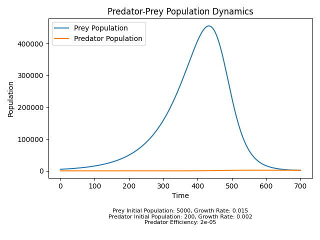

# Predator-Prey Ecosystem Simulation

This project simulates the dynamics of a predator-prey ecosystem over a specified number of time steps. The ecosystem consists of two populations: prey and predator. The simulation tracks the changes in these populations over time based on their growth rates and interactions.

## Introduction

The main goal of this project is to model and visualize the population dynamics of a predator-prey ecosystem. The simulation is implemented using Python with the help of the `matplotlib` library to generate visual plots.

## Requirements

To run this project, you need to have Python installed, along with the following libraries:

- `matplotlib`

## Usage

1. Clone the repository or download the `main.py` file.
2. Ensure you have the required libraries installed by running: `pip install matplotlib`.
3. Execute the script by running: `python main.py`.
4. The script will simulate the ecosystem dynamics and generate a plot showing the changes in the prey and predator populations over time.

## Simulation

The simulation is carried out using the `Population` class and the `simulate_ecosystem` function in the `main.py` file. The `Population` class represents a population with an initial size and a growth rate. It also has methods to simulate population growth and decrease.

The `simulate_ecosystem` function takes initial populations of prey and predator, the growth rates of both populations, the predator efficiency, and the number of time steps to simulate. It then iterates over the time steps, calculating the changes in prey and predator populations based on their respective growth rates and interactions.

## Plot

After the simulation, the script generates a plot using the `plot_population_dynamics` function. The plot shows the dynamics of both the prey and predator populations over time. The x-axis represents time steps, while the y-axis represents the population size. The plot also includes labels and a legend for better understanding.

## Configuration

The initial population sizes and growth rates for the prey and predator, along with the predator efficiency and the number of time steps, are defined in the `main` function. You can modify these values to observe different ecosystem scenarios.

The configuration information, including the initial population sizes and growth rates of the prey and predator, and the predator efficiency, will be displayed as a footnote on the plot.

